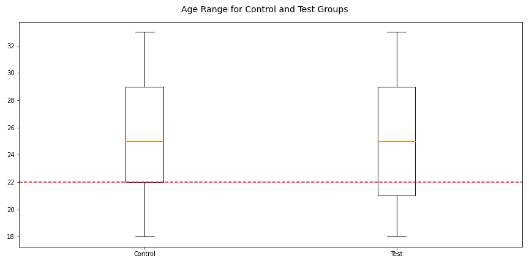
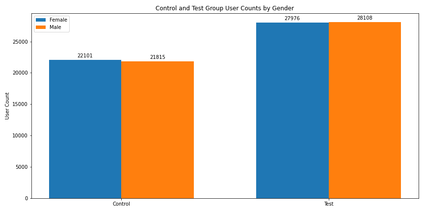
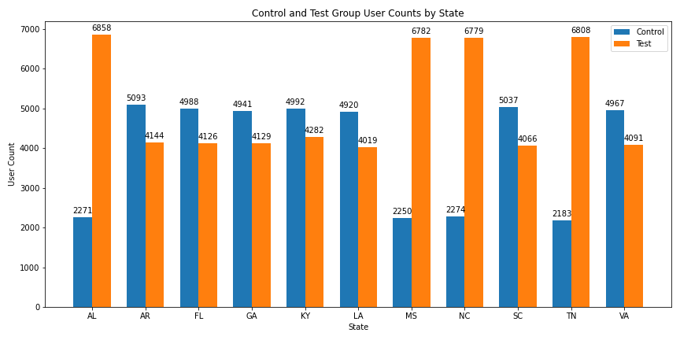
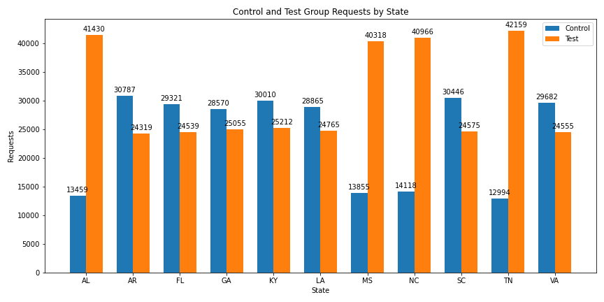
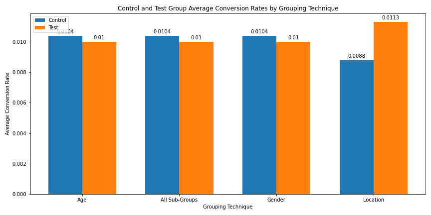
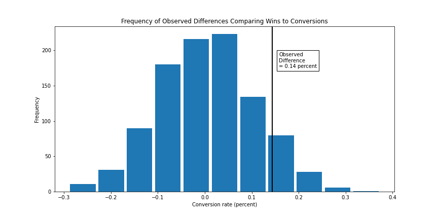
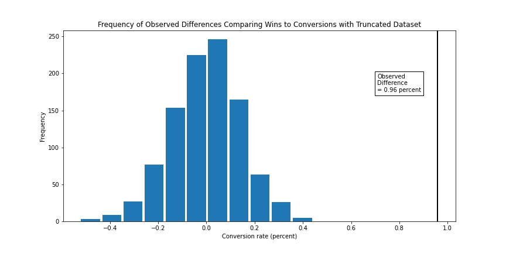

# Vericast Marketing Campaign Analysis

This analysis will evaluate marketing campaign performance through exploratory data analysis and hypothesis testing.

## Description

Vericast has run a digital advertising campaign for one of its clients, targeting mobile users in the Southeast. The goal of the campaign was to drive conversions -- users clicking through the ad and accepting the client's offer.

Vericast ran two creatives (distinct ad designs) during the campaign: a baseline creative in line with the client's previous campaigns, and a new creative designed to increase conversions by more prominently displaying the offer to the user.  To test the effectiveness of the new ad, some users were assigned to a "test" group that received the new ad during the campaign, while the remaining users belonged to a "control" group.

At a minimum, this analysis will answer the two questions below with all code and output shown, well formatted, and well documented.

### Exercises / Questions
1. What do the different distributions of requests by user tell us?
Please describe the distributions related to requests and the users we targeted. We are interested in both visual and numerical analysis/explorations of the data distributions.
2.	Based on insights from #1, was the test effective? Were test users more likely to convert than control users? Did the new creative increase conversions?

### Repo Contents

This repo is organized into the following file structure:

* Vericast Home Directory
    * README
    * Original Project Description `MDS Analytical Exercise.docx`
    * [Data](https://github.com/jkurdys/Vericast/tree/main/data) Directory: all source and output data saved as CSVs
        * source data `bid_requests.csv`, `user_attributes.csv`
        * output data `atts.csv`
    * [Images](https://github.com/jkurdys/Vericast/tree/main/images) Directory: Explanatory charts from EDA notebook
    * [Notebooks](https://github.com/jkurdys/Vericast/tree/main/notebooks) Directory: Exploratory Data Analysis with project walkthrough and findings

## Table of Contents
* [Description](#description)
    * [Exercises / Questions](#exercises--questions)
    * [Repo Contents](#repo-contents)
* [Analysis and Question Responses](#analysis-and-question-responses)
    * [Approach](#approach)
    * [Responses](#responses)
* [Findings](#Findings)
* [Authors](#authors)

## Analysis and Question Responses
I will briefly describe my approach to analysis before responding to the question prompts. For the complete analysis, please consult the [EDA notebook](https://github.com/jkurdys/Vericast/blob/main/notebooks/EDA.ipynb).

### Approach

I begin with data extraction and inspection to determine what cleaning and preprocessing would be required for analysis. Preprocessing consisted of extracting user attributes from a text blob and creating a dataframe consisting of user attributes and unique user-ids.

Relying on the users table, I grouped users into control and test groups and analyzed age, gender and location information in each group. I noted any stark differences between the groups and described the impact those differences would have on analysis.

Analysis began in earnest by joining the user table to the bid table to identify the user targeted in each bid request. Using same process of comparing control and test groups by demographic segments, I employed average conversion rate per request as a general indicator of performance. The results suggested the possibility of sampling error, so I attempted to estimate the magnitude of the effect by hypothesis testing the full dataset and compared results to hypothesis testing on a truncated dataset designed to reduce sampling error.

Hypothesis testing strengthened the case for sampling error and indicated that a more precise metric of conversion rate per winning bid would be a better standard to evaluate campaign performance.

### Responses

>What do the different distributions of requests by user tell us?
Please describe the distributions related to requests and the users we targeted. We are interested in both visual and numerical analysis/explorations of the data distributions.

Comparing users in the control and test groups suggested relatively equivalent distributions across both groups for age and gender demographics, but indicated oversampling from a few states in the geographic data.

Slight differences in age ranges represented in control and test groups indicated only natural variation in sampling.



The same natural variation characterized user gender distributions.



Notable oversampling in Alabama, Mississippi, North Carolina and Tennessee ran contrary to a more general trend to undersample the test group in the remaining locations.



The same oversampling appeared when comparing distributions of requests rather than users by location as well.



The signs of location oversampling among a few states suggested that the geographic differences between the control and test groups could compromise the effectiveness of the campaign. Indeed, without segmentation, the campaign appeared to be a failure due to the decline in conversion rate between control and test groups. The probable effects of the location based sampling error appear in the following graph showing a small loss in conversion rate for all sub-groups except location-based groupings.



>Based on insights from #1, was the test effective? Were test users more likely to convert than control users? Did the new creative increase conversions?

It's difficult to impossible to estimate the success of the campaign considering the likely effects of sampling error. The decline in conversion rate by request currently provides a rough estimation that the campaign failed to increase conversions in the test group.

Selecting a more relevant metric, the conversion rate among winning bids rather than among all requests offers a better basis for measuring campaign performance. Applying a permutation testing resampling technique to a binary hypothesis test (A/B Test), we see that the test group did improve when we applied the winning bid conversion rate metric to evaluate performance.



Although the new metric suggested an improvement with the new creative, the statistical confidence for this observation was inconclusive. Only when correcting for the sampling error identified previously, could statistically significant results be observed.



By removing the location outliers and eliminating users and requests from Alabama, Mississippi, North Carolina and Tennessee, I created a truncated dataset in order to correct oversampling error observed in these states. This approach cannot be justified on experimental grounds. The correct solution would be to adjust the location sampling technique for dividing control and test groups to get a more equitable distribution. This truncated dataset gives an indication that a stronger and statistically significant success for the new creative might result from correcting the sampling imbalance, but the results are essentially invalid due to the sampling error in the campaign design.

## Findings
Hypothesis testing confirmed that the location-based sampling error observed in the user and requests distributions likely affected the overall conversion rate from requests. This damaged our ability to assess the campaign's success and initially suggested the campaign's failure.

Using a more accurate measurement of campaign performance, conversion rate per winning bid, produced marginal evidence that the campaign had sucessfully increased conversion with the new creative approach.

We also observed evidence that correcting the sampling error could increase the magnitude and significance of the new creative's success.
<!-- ## Getting Started

### Dependencies

* Describe any prerequisites, libraries, OS version, etc., needed before installing program.
* ex. Windows 10

### Installing

* How/where to download your program
* Any modifications needed to be made to files/folders

### Executing program

* How to run the program
* Step-by-step bullets
```
code blocks for commands
```

## Help

Any advise for common problems or issues.
```
command to run if program contains helper info
``` -->

## Authors

[Joshua Kurdys](https://www.linkedin.com/in/joshua-kurdys/)

<!-- ## Version History

* 0.2
    * Various bug fixes and optimizations
    * See [commit change]() or See [release history]()
* 0.1
    * Initial Release

## License

This project is licensed under the [NAME HERE] License - see the LICENSE.md file for details

## Acknowledgments

Inspiration, code snippets, etc.
* [awesome-readme](https://github.com/matiassingers/awesome-readme)
* [PurpleBooth](https://gist.github.com/PurpleBooth/109311bb0361f32d87a2)
* [dbader](https://github.com/dbader/readme-template)
* [zenorocha](https://gist.github.com/zenorocha/4526327)
* [fvcproductions](https://gist.github.com/fvcproductions/1bfc2d4aecb01a834b46) -->